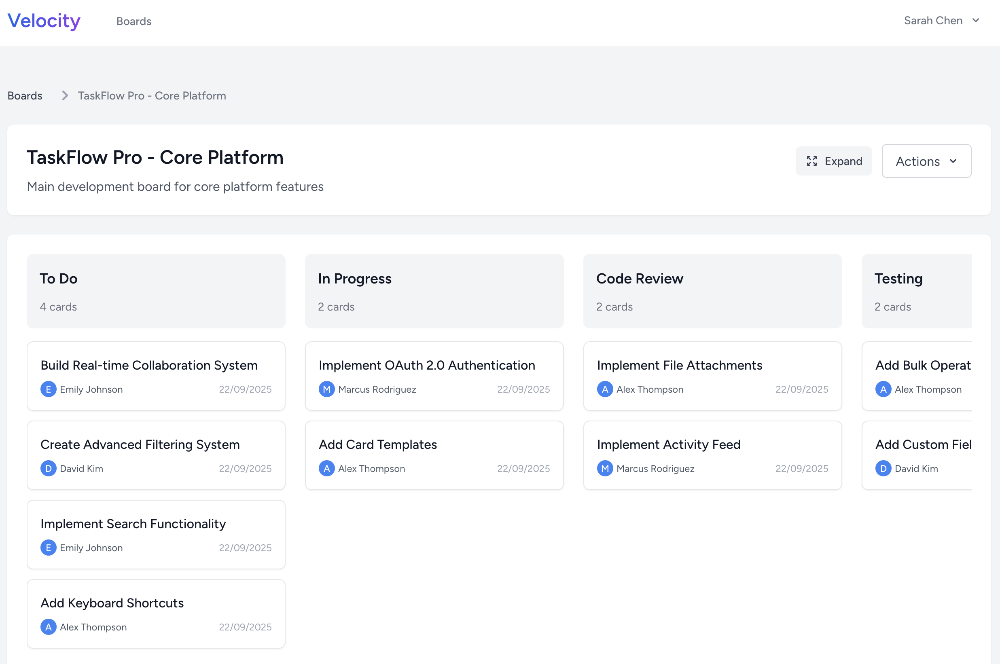
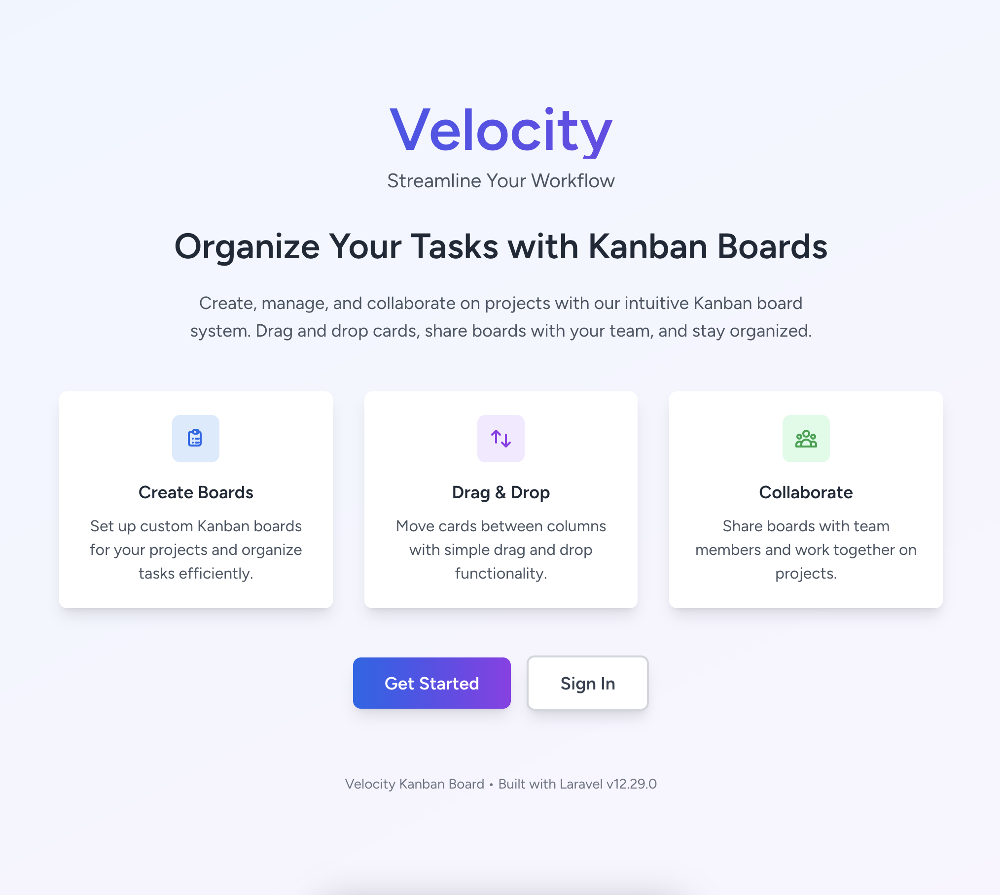
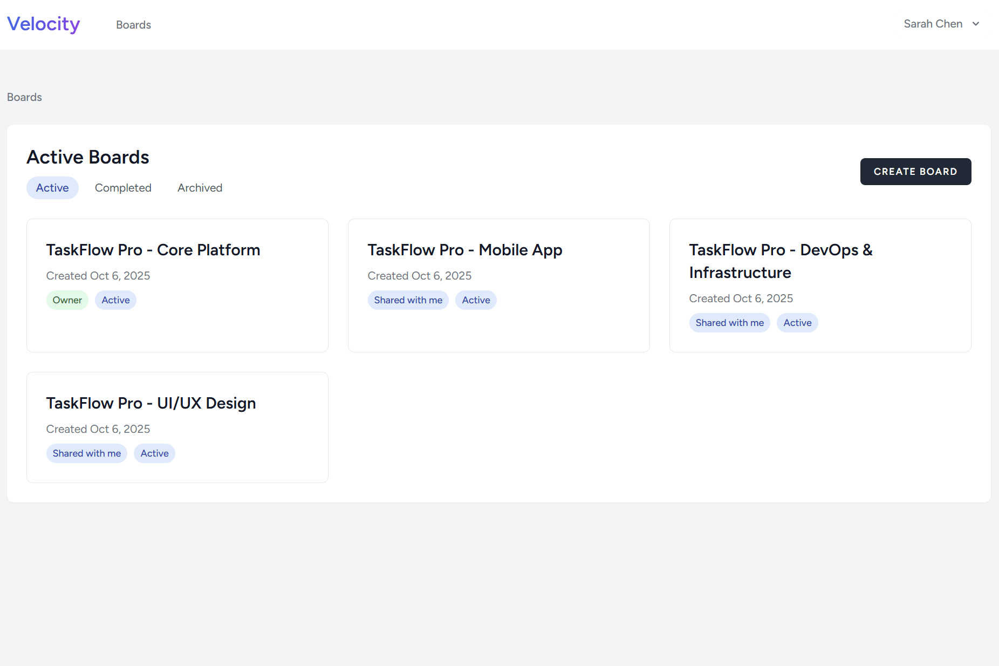
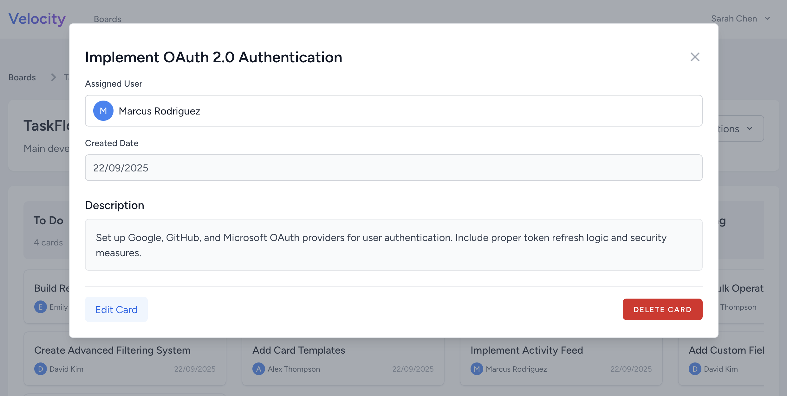
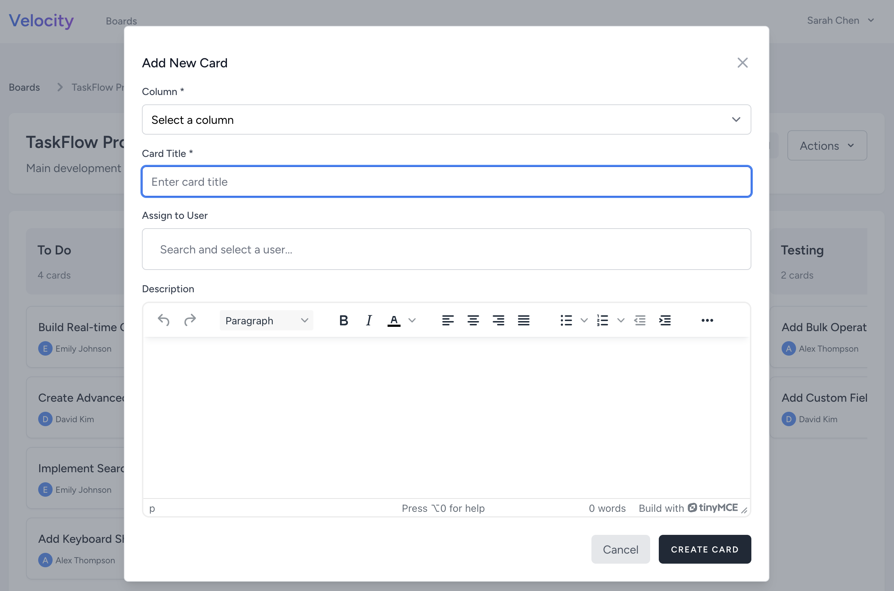
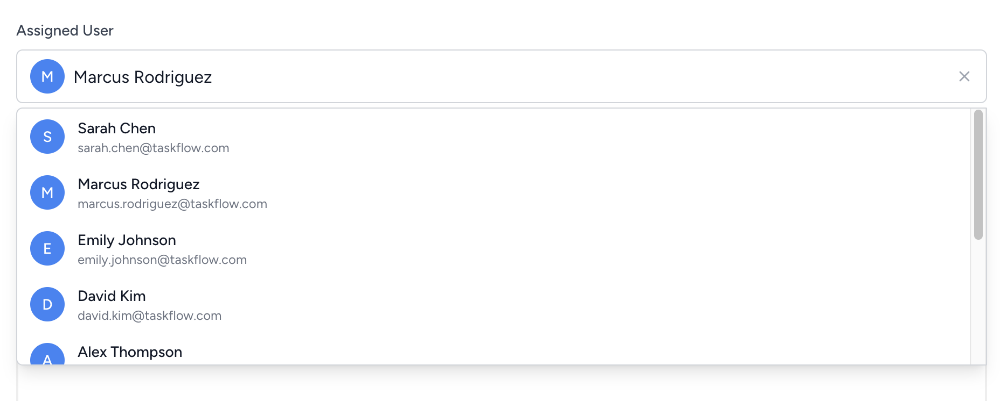
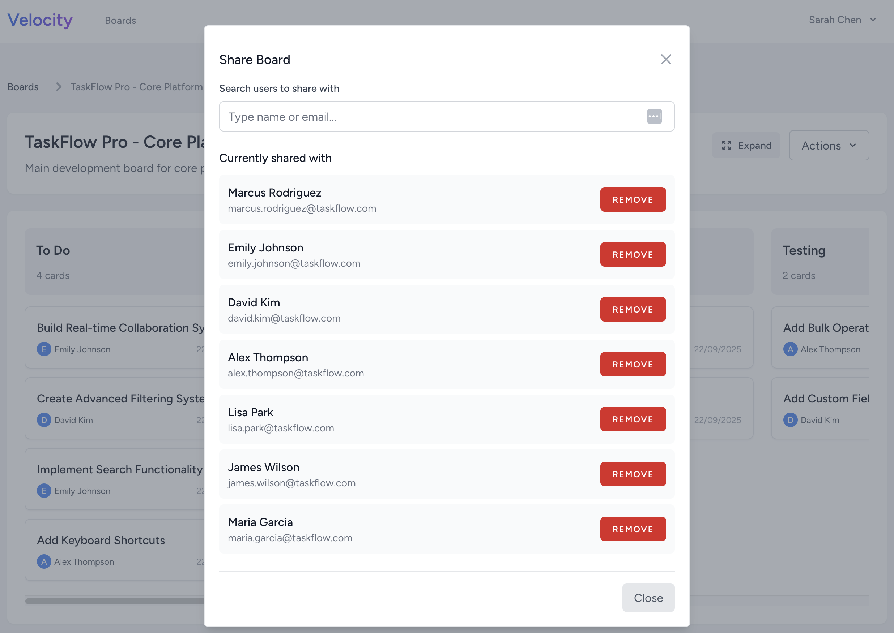

# Velocity - Kanban Board

Velocity is a collaborative project management application featuring drag and drop kanban boards, user assignments, and team collaboration. Built with Laravel, React, and Inertia.js.



[See more images here](#screenshots)

## Features

- **Drag & Drop Kanban Boards**: Intuitive drag-and-drop interface for organising tasks across customizable columns
- **User Assignment**: Assign cards to team members with visual user indicators and assignment management
- **Board Sharing**: Collaborate with team members by sharing boards with different access levels
- **Real-time Updates**: Live updates when multiple users are working on the same board
- **Rich Text Editing**: Detailed card descriptions with TinyMCE rich text editor
- **Responsive Design**: Works seamlessly on desktop, tablet, and mobile devices

## Getting Started

### Installation

1. Clone this repository to your local machine:

```sh
git clone https://github.com/ben04rogers/kanban-laravel.git
```

2. Install project dependencies using Composer and NPM:

```sh
composer install
npm install
```

3. Create a copy of the .env.example file and name it .env:

```sh
cp .env.example .env
```

4. Generate a unique application key:

```sh
php artisan key:generate
```

5. Update the .env file with your database configuration. Set the DB_DATABASE, DB_USERNAME, and DB_PASSWORD to match your local database setup.

6. Run database migrations to create the necessary tables:

```sh
php artisan migrate
```

7. Seed database with realistic test data:

```sh
php artisan db:seed
```

### Running locally

1. Run the Laravel app

```sh
php artisan serve
```

2. Compile and bundle front end assets

```sh
npm run dev
```

### Test Login Credentials

The seeder creates several test users. All users have the password: `password`

- **sarah.chen@email.com** - Project Manager
- **marcus.rodriguez@email.com** - Backend Developer
- **emily.johnson@email.com** - Full-stack Developer
- **david.kim@email.com** - Mobile Developer
- **alex.thompson@email.com** - Frontend Developer
- **lisa.park@email.com** - UX Designer
- **james.wilson@email.com** - DevOps Engineer
- **maria.garcia@email.com** - QA Engineer

## Technical Stack

- **Backend**: Laravel 11 with PHP 8.2+
- **Frontend**: React 18 with Inertia.js
- **Database**: SQLite
- **Styling**: Tailwind CSS
- **Rich Text**: TinyMCE Editor
- **Authentication**: Laravel Breeze with Inertia

## Screenshots

> A tour of the main features. Images are stored in `docs/screenshots/`.

<table>
  <tr>
    <td align="center" valign="top" width="50%">
      
      <div><sub><b>Landing Page</b> — Welcome to Velocity Kanban Board</sub></div>
    </td>
    <td align="center" valign="top" width="50%">
      
      <div><sub><b>Boards Index</b> — Overview of all accessible boards</sub></div>
    </td>
  </tr>
  <tr>
    <td align="center" valign="top" width="50%">
      
      <div><sub><b>Kanban Board</b> — Drag-and-drop task management interface</sub></div>
    </td>
    <td align="center" valign="top" width="50%">
      
      <div><sub><b>Card Detail</b> — Detailed view with editing capabilities</sub></div>
    </td>
  </tr>
  <tr>
    <td align="center" valign="top" width="50%">
      
      <div><sub><b>Create Card</b> — Add new tasks with user assignment</sub></div>
    </td>
    <td align="center" valign="top" width="50%">
      
      <div><sub><b>User Assignment</b> — Assign tasks to team members</sub></div>
    </td>
  </tr>
  <tr>
    <td align="center" valign="top" width="50%">
      
      <div><sub><b>Board Sharing</b> — Collaborate with team members</sub></div>
    </td>
  </tr>
</table>